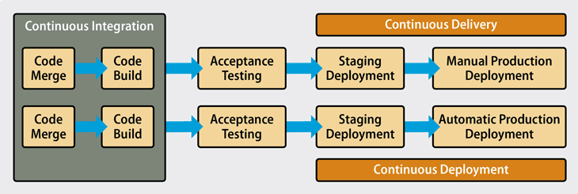

# DevOps, DevSecOps

## Introduction

Once we have complete the development of our microservice, we want to make it available to other microservices in a production environment.

So, we need to push it into a **Container Registry**, that store all version of our container image.

There are many **Container Registry** that we can use, such us **Docker Hub**, **GitLab Container Registry**, **GitHub Packages Registry** or we can also host our **personal Docker Registry**.

To **build** and **publish** a new version of our container image we need first to **login** to our container registry:

```bash
docker login registry.gitlab.com -u myusername --password-stdin
```

**Build** a new image with the **latest** tag:

```bash
docker build -t registry.gitlab.com/michelemosca/cloudedgecomputing:latest .
```

And **push** it into the container registry:

```bash
docker push registry.gitlab.com/michelemosca/cloudedgecomputing --all-tags
```

Once the new version of our container image is available inside the container registry, other microservices can interact with this new version by adding it as **image** inside the **docker-compose** file:

```yml
web:
    image: registry.gitlab.com/michelemosca/cloudedgecomputing:latest
    stop_signal: SIGINT
    environment:
      - SQLALCHEMY_DATABASE_URI=${SQLALCHEMY_DATABASE_URI}
    ports:
      - '80:5000'
    depends_on:
      postgres:
        condition: service_healthy
```

Force docker to **pull** the new version of the container image with the following command:

```bash
docker compose pull
```

And after all, **restart** the microservice in order to use the latest image:

```bash
docker compose up -d --build --no-deps web
```

All this operations needs to be performed **every time** we develop a new feature to our microservice.

To help us in these operations we can use **DevOps**'s practices. 

## DevOps

### Definitions
There are various definitions of DevOps from both industry and academia that, while differing in phrasing, convey similar core concepts:

**Industry Perspectives:**
- DevOps is a set of practices and tools that combines software development (Dev) and IT operations (Ops). It aims to shorten the systems development life cycle and provide continuous delivery with high software quality. DevOps is complementary to Agile software development; many aspects of DevOps have emerged from the Agile way of working. (Wikipedia)
- DevOps is the combination of cultural philosophies, practices, and tools that increases an organization’s ability to deliver applications and services at high velocity. (AWS)
- DevOps is a set of practices, tools, and a cultural philosophy that automates and integrates the processes between software development and IT teams, emphasizing team empowerment, cross-team communication, and technology automation. (Atlassian)
- DevOps is a combination of software developers (Dev) and operations (Ops). It is defined as a software engineering methodology that aims to integrate the work of software development and operations teams by facilitating a culture of collaboration and shared responsibility. (GitLab)

**Academic Perspectives:**
- DevOps is a collaborative and multidisciplinary organizational effort to automate the continuous delivery of new software updates while guaranteeing their correctness and reliability. (Leite et al, 2020)
- It represents an organizational shift in which cross-functional teams work on continuous operational feature deliveries, rather than siloed groups performing functions separately. (Ebert et al, 2016)
- DevOps is a development methodology aimed at bridging the gap between Development (Dev) and Operations (Ops), emphasizing communication and collaboration, continuous integration, quality assurance, and automated deployment through a set of development practices. (Jabbari et al, 2016)


### How does it work?

In the DevOps model, **development** and **operations** teams no longer work in isolation.

Instead, they often integrate into a single unit, where engineers participate throughout the application lifecycle — from **development** and **testing** to **deployment** and **production** — and gain a versatile skill set that spans multiple functions.

Teams use **automation** to accelerate traditionally slow, manual processes. DevOps tools and technologies enable faster, more **reliable** deployment and evolution of applications.

These tools also empower teams to handle tasks that once required support from other departments, such as **code deployment** or **infrastructure provisioning**, boosting overall **efficiency**.

### Key principles


**Continuous Integration (CI)**

Continuous Integration (CI) is a development practice where team members frequently commit code to a shared repository, often multiple times a day. Each code update triggers automated testing and builds, allowing developers to quickly **identify and resolve integration issues** or bugs. CI helps maintain a stable codebase and encourages collaboration, speeding up the overall development cycle.

**Continuous Delivery (CD)**

Continuous Delivery (CD) builds on CI by automating the testing and preparation of code changes for release. Once code passes all automated tests, it is integrated into the main branch, where it becomes **ready for deployment** at any time. This practice enables teams to release new features, fixes, or updates more frequently and reliably, as the code is always in a deployable state.

**Continuous Deployment (CD)**

Continuous Deployment is the final step in the DevOps pipeline, automating the release of every code change that passes all tests directly into the **production environment**. By eliminating the need for manual deployment steps, continuous deployment enables a rapid feedback loop with users, providing immediate updates and ensuring that customers have access to the latest features without delays.

**Continuous Testing**

This practice includes automated, scheduled, and continuous code tests during the writing or updating of application code. Such tests can speed up the delivery of code to production.

**Automation**

Automation is a critical DevOps practice that streamlines the software development lifecycle. By automating processes such as testing, integration, and deployment, developers have more time to focus on writing code and developing new features. Automation is central to the CI/CD pipeline, reducing human errors and boosting team productivity. Short iteration cycles made possible by automation enable teams to respond quickly to user feedback.

**Infrastructure as Code (IaC)**

This practice can be used during the various DevOps phases to enable the automation of infrastructure management and provisioning through code, ensuring consistency, repeatability and speed in the creation and modification of environments, thus facilitating collaboration between development and operations teams.

**Monitoring and Feedback**

Monitoring applications and gathering feedback from customers and users are essential for identifying and resolving issues quickly. Feedback loops help inform future development decisions, ensuring continuous improvement of the software.

**Collaboration, Communication, and Shared Responsibility**

Collaboration between development and operations teams is at the heart of DevOps. These teams merge into a single functional unit, working together throughout the entire application lifecycle, from planning to release. This close collaboration is built on open and continuous communication, shared feedback, and joint responsibility for delivering quality results.

DevOps team members are responsible for the entire product lifecycle, including both front-end and back-end tasks. This comprehensive involvement leads to higher-quality outcomes and breaks down silos between different business functions.


### Phases and Toolchain


**1. Planning**

In this phase, the business value and requirements are defined. Teams establish the project goals and identify the necessary elements for the upcoming release.

**Tools**: Jira, Git

**2. Coding**

The coding phase involves designing and developing the software, where developers create and update the source code.

**Tools**: GitHub, GitLab, Bitbucket

**3. Build**

In this phase, software builds and versions are managed and automatic tools are used to compile and package the code for the next release sent to production. Code repositories or source package repositories are used, which also include the infrastructure required for the product release.

**Tools**: Docker, Ansible, Puppet, Chef, Gradle, Maven, JFrog Artifactory

**4. Testing**

This phase involves continuous testing to ensure the software is bug-free and ready for production. Tests can be automated or manual.

**Tools**: JUnit, Codeception, Selenium, Vagrant, TestNG

**Deployment**
In the deployment phase, the software is distributed to production environments. DevOps tools automate the deployment process to ensure repeatability and reliability.

**Tools**: Puppet, Chef, Ansible, Jenkins, Kubernetes, OpenShift, OpenStack, Docker

**Operations**
This phase is focused on managing the software in production. Automation tools support continuous system maintenance.

**Tools**: Ansible, Puppet, PowerShell, Chef, Salt, Otter

**7. Monitoring**
In the monitoring phase, the software’s performance is analyzed to identify any issues and ensure system stability.

**Tools**: New Relic, Datadog, Grafana, Wireshark, Splunk, Nagios, Slack


### Key Metrics

DevOps metrics are data points that directly reveal the performance of a DevOps pipeline and help identify bottlenecks. These metrics enable DevOps teams to track progress in achieving high-level goals, including faster release cycles and improved application performance.

**Lead Time for Changes**

Lead time measures the period between a code commit and the point where it is ready for production (passes tests and reviews). High-performance teams typically measure lead times in hours, whereas low-performance teams may take days or weeks.


Key practices to improve lead time include test automation, trunk-based development, and working in small batches. These ensure quick feedback and the ability to address defects early.

**Change Failure Rate**

This metric tracks the percentage of deployments that require quick fixes or rollbacks after production. High-performance teams aim for a rate of 0% to 15%.

Practices such as test automation and trunk-based development are correlated with reduced failure rates, as they simplify identifying and fixing defects early in the process.

**Deployment Frequency**

This measures how often teams deploy updates to production. High-performance teams can deploy multiple times a day, while low-performance teams may deploy weekly or monthly.

Frequent deployments require an automated pipeline that includes testing, feedback mechanisms, and minimizes manual intervention.

**Mean Time to Recovery (MTTR)**

MTTR measures the time it takes to recover from production incidents or failures. High-performance teams typically recover in under an hour, while low-performance teams may take days.

Quick recovery relies on continuous monitoring, alerting systems, and the ability to rapidly deploy fixes or roll back problematic changes.


## DevSecOps

**DevSecOps** is a strategic approach that integrates three key disciplines: **development**, **security**, and **operations**. Its primary goal is to embed security practices into the continuous integration and continuous delivery (CI/CD) pipeline across both **pre-production** (development, testing, staging) and **production** (operations) environments.

By adopting DevSecOps, teams can **release higher-quality software more quickly** and **detect and respond to software vulnerabilities** in production with greater efficiency.


### Historically

Application security has been addressed after development is completed, and by a separate team of people, separate from both the development team and the operations team.
This approach **slowed down** the development process and the reaction time.

Also, security tools themselves have historically been isolated. Each application security test looked only at that application, and often only at the source code of that application.

This made it hard for anyone to have an organization-wide view of security issues, or to understand any of the software risks in the context of the production environment.

By making **application security** part of a unified **DevSecOps** process, from initial design to eventual implementation, organizations can align the three most important components of software creation and delivery.

### Challenges in implementing DevSecOps

The first challenge lies in addressing people and culture: it may be necessary to retrain members of your DevOps teams to understand security best practices and effectively utilize new security tools.

The second challenge involves selecting the right security tools and integrating them into your DevOps workflow. The more automated and seamlessly integrated your DevSecOps tooling is with your CI/CD pipeline, the less training and cultural adjustment will be required.

However, simply opting for a more automated version of the security tools you’ve been using for years may not be the best solution. Your development environment has likely undergone significant changes in recent years, necessitating a reevaluation of the tools and practices that best fit your current needs.

### Top traits of successful DevSecOps practices

Here are the **key performance indicators** (**KPIs**) to measure the effectiveness of your DevSecOps initiatives:

- **Security Awareness and Ownership**: Cultivate a culture where "security is everyone’s responsibility," encouraging all team members to prioritize security in their roles.
- **Automated Operations**: Implement automation to streamline security processes, reducing manual efforts and enhancing efficiency.
- **Fast Results**: Aim for quick feedback and results from security initiatives, enabling rapid response to vulnerabilities.
- **Wide Scope**: Ensure that security measures are applicable across all types of environments, from development to production.
- **Shift-Left and Shift-Right**: Monitor applications throughout the **software development lifecycle** ("**shift left**") as well as in **production environments** ("**shift right**") to maintain comprehensive security oversight.
- **Accuracy**: Achieve DevSecOps efficiency by utilizing security tests that minimize false positives and false negatives, delivering actionable insights to your remediation team.
- **Developer Acceptance**: Foster acceptance and collaboration among developers, ensuring they are engaged in the security process and understand its importance.
